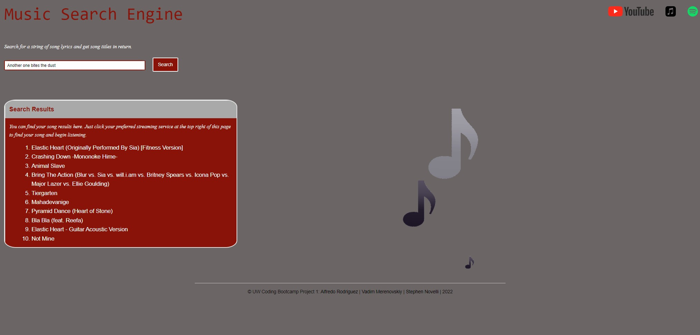

# project-one

UW Coding Bootcamp Project One: Music Search Engine
Group members: Alfredo Rodriguez, Vadim Merenovskiy, and Stephen Novelli

Description:
Our project uses the Foundation CSS framework, iconify icon framework, and Musixmatch API to style and create an interactive music search engine. A user is required to type in a lyric string into the search bar, and the musixmatch API returns a 10 track list containing those lyrics that is printed to the page. At the top right of the screen there are buttons that are linked out to music streaming and download sites where you can listen to or download your song. 

Github Repository Link:
https://github.com/RunninFridge/project-one

Github Pages Link:

